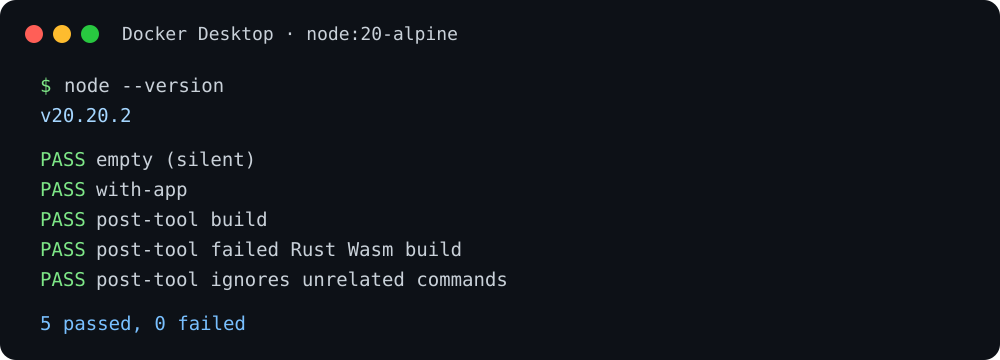
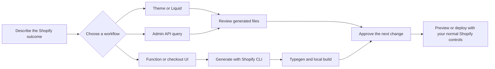

# Shopify DevKit for Claude Code

Ship Shopify work with more confidence. Shopify DevKit gives Claude Code practical, guarded workflows for the work that tends to be expensive to get wrong: theme changes, Liquid sections, Functions, checkout extensions, and Admin API queries.

It does not connect to your store, deploy code, or read secrets on its own. It helps you plan, scaffold, inspect, and verify work locally, keeping the final decision with you.



## Where it helps

| When you need to… | Start here | What you get |
| --- | --- | --- |
| Launch a clean Online Store 2.0 foundation | `/shopify-devkit:theme-init` | A conventional theme layout Claude can extend safely |
| Add a merchant-editable storefront feature | `/shopify-devkit:liquid-section` | Liquid, schema, blocks, presets, and accessibility-minded defaults |
| Review a theme before a release | `/shopify-devkit:theme-audit` | A read-only list of performance, escaping, and form-accessibility risks |
| Add checkout behavior | `/shopify-devkit:checkout-ui-ext` | A CLI-aligned extension workflow that respects checkout capabilities |
| Build a discount or customization rule | `/shopify-devkit:shopify-function` | A current CLI-first path for Functions, type generation, and local builds |
| Write a safe Admin GraphQL operation | `/shopify-devkit:admin-api-query` | A minimal, paginated query or mutation with scopes and user errors |

## The experience



The plugin also detects a Shopify app or theme when a Claude Code session starts and suggests the most relevant command. After a Shopify build, deploy, or theme push command, it adds a short next-step reminder. These hooks run locally and are silent outside a Shopify project.

## Install from a GitHub ZIP

This is a **Claude Code plugin**. It works on macOS and Windows wherever the Claude Code CLI is installed. A GitHub ZIP can be loaded directly for a session; no unzip step is needed.

1. On the repository’s **Releases** page, download the `shopify-devkit-1.0.2.zip` asset. If you use GitHub’s **Code → Download ZIP** instead, use the downloaded archive name in the commands below.
2. Open Terminal on macOS or PowerShell on Windows.
3. Start Claude Code with the ZIP.

macOS:

```bash
claude --plugin-dir "$HOME/Downloads/shopify-devkit-1.0.2.zip"
```

Windows PowerShell:

```powershell
claude --plugin-dir "$HOME\Downloads\shopify-devkit-1.0.2.zip"
```

For a local checkout instead of a ZIP:

```bash
claude --plugin-dir /path/to/shopify-devkit
```

`--plugin-dir` loads the plugin for that Claude Code session. For repeatable team installation, publish it through a Claude Code marketplace and use `/plugin install shopify-devkit`. The Claude web and desktop chat apps do not use the Claude Code `--plugin-dir` installation flow; this repository is not an MCP server or a standalone Shopify app.

## A useful first session

From a Shopify app or theme directory, ask Claude:

```text
Run /shopify-devkit:doctor, then give me a read-only release audit of this theme.
```

Or choose an outcome:

```text
Use /shopify-devkit:liquid-section to add a merchant-editable featured collection.
Use /shopify-devkit:shopify-function to create a volume discount in Rust.
Use /shopify-devkit:admin-api-query to list recently updated products with variants.
```

For checkout UI extensions and Shopify Functions, the plugin starts from the **installed Shopify CLI generator** instead of freezing old templates. This matters because Shopify targets, packages, and function APIs change over time. It keeps the generated project aligned with your local CLI and asks before writing or building.

## Built-in guardrails

- Audits are read-only; they report risks without changing merchant code.
- Destructive, overwrite, deploy, and publish actions require explicit direction.
- The plugin does not print Shopify tokens or `.env` values.
- Checkout capabilities are opt-in and called out before use.
- Function and extension API versions are pinned. New examples use Shopify `2026-07`; existing apps retain their own generated version until deliberately upgraded.

## What was verified

Version 1.0.2 was validated with Claude Code 2.1.206 and Docker Desktop using a clean Node 20 container. The container ran the session-start and post-tool hook cases, JavaScript syntax checks, and manifest field checks. The Docker output shown above is from that run.

The verification is intentionally local and lightweight. It does not authenticate to Shopify, open a tunnel, access a merchant store, or deploy an app. Before publishing Shopify code, run the CLI build and test it in a development store.

## Requirements

- Claude Code 2.0 or newer.
- Node.js for the optional local hooks. Without Node, the skills and commands still work; only the context reminders are skipped.
- Shopify CLI for scaffolding, local development, builds, and deployment.
- For current Rust Functions: Rust with `wasm32-unknown-unknown` (`rustup target add wasm32-unknown-unknown`).

## Privacy and support

The plugin runs locally. See [PRIVACY.md](PRIVACY.md) for details. For support or feature requests, open a [GitHub issue](https://github.com/mohitkale/shopify-devkit/issues).

## License

MIT. See [LICENSE](LICENSE).
